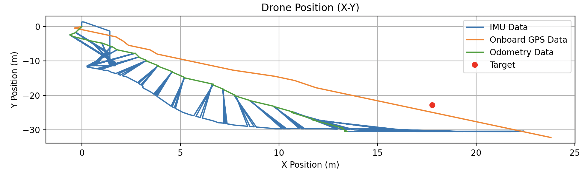
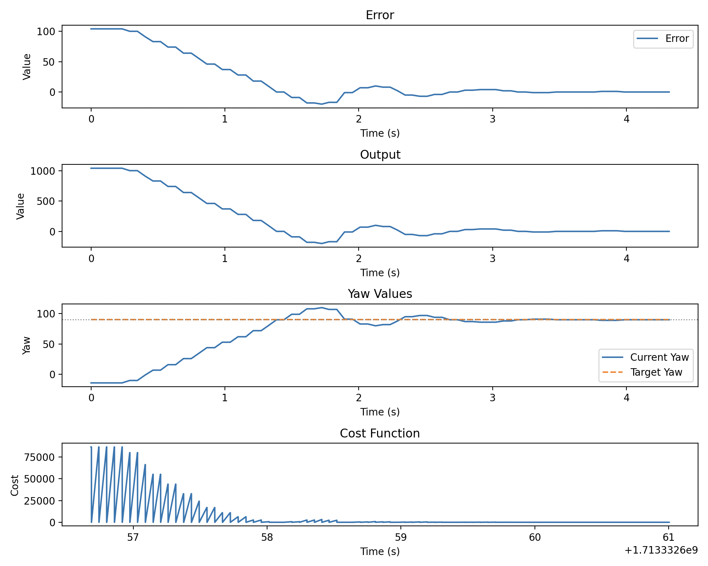
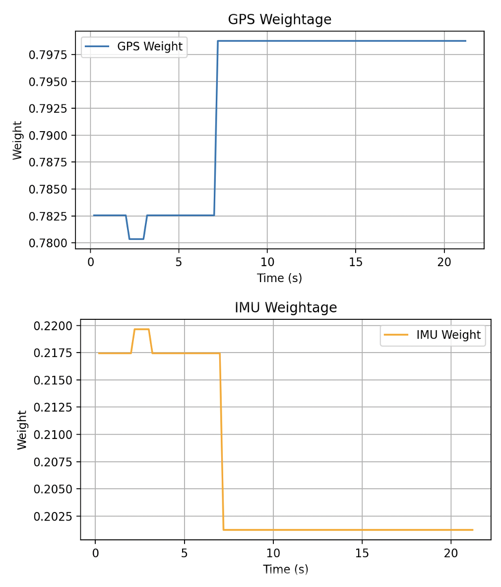

# GPS-IMU-Integrated-Navigation-System

This project is a GPS-IMU integrated navigation system for controlling the DJI Tello drone. This system utilizes the DJITelloPy library for drone control, while collecting GPS and IMU data from the BN-180 GPS module and the Tello drone's built-in IMU module, respectively.

### Useful Links:
* **DJITelloPy**: https://djitellopy.readthedocs.io/en/latest/
* **GPSVisualizer**: https://www.gpsvisualizer.com/map_input

## Setup:
1. Clone the repository and install all the required packages:
```bash
git clone https://github.com/shreypatel1/GPS-IMU-Integrated-Navigation-System.git
cd GPS-IMU-Integrated-Navigation-System
```

2. Install all the required packages listed in setup.py::
```bash
pip install <package>
```
> Note: If you get an error about a missing package or module during runtime, install the package using the command above.


## Running the project:
Before running the project, ensure that the Arduino Uno with BN-180 gps module is connected to the computer and recieving data. Aditionally, verify that the `arduino_pot`value in the `steup.py` file is set to the correct port value for the Arduino Uno.

Finding the port:
* Mac: Use `ls /dev/tty.*` in the terminal.
* Linux: Use `ls /dev/tty*` in the terminal.
* Windows: Navigate to `Devices and Settings > COM?` in the Control panel.

After the setup is complete, run the `main.py` file:
```bash
python main.py
```

If running this project on a Mac, please execute `main.py` with administrator privilages due to the use of the [`keyboard`](https://pypi.org/project/keyboard/) module.
```bash
sudo python main.py
```

> Avoid running any of the individual files in the project directory except `main.py` and `examples/`, as they are not standalone and won't function correctly.


## Termination procedure:
To terminate the program, simply press the `esc`
 key. This ensures proper termination and completion of all processes.
> Avoid using `ctrl + c` for termination, as it would cause the program to terminate abruptly, and not save the data collected during the flight


## Data collection:
All the data collected and calculated during the flight is stored in the `last_flight_data` directory in `.csv` format after the program is terminated. This data can be further analyzed as needed.

Currently, `last_flight_data` is overwritten every time the program is run. If you want to save the data from a previous flight, make sure to copy the data to a different directory before running the program again.

Use the `test.py` file in the `examples` directory to test the data collection and calculation process without running the entire program.(Only supports location graph for now)

<div style="display: flex; flex-direction: column;">
    
    <div style="display: flex; flex-direction: row;">
        
        
    </div>
</div>


## Clearing cached files:
Execute the following command for clearing all compiled python files (`.pyc`) in the project directory:
```bash
find . -name "*.pyc" -exec rm -f {} \;
```

If you permission issues arise, use this command:
```bash
find . -name "*.pyc" -exec sudo rm -f {} \;
```
